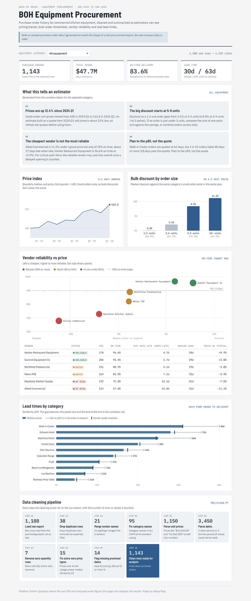

# BOH Equipment Procurement Dashboard

A small Python project that cleans a messy purchase-order export for back-of-house kitchen equipment and turns it into a dashboard estimators can use.

**Live dashboard:** https://u-daya.github.io/boh-procurement-dashboard/



> The data in this repo is sample data I generated to look like a real procurement export. No real company data is used.

## The problem

When an estimator prices out equipment for a new kitchen, a few questions come up every time:

- **How much have prices moved?** A quote from last year might not be good anymore.
- **When does ordering more get cheaper?** Is there a quantity where the vendor discount jumps?
- **Which vendors actually deliver on time?** The cheapest vendor is not always the best deal if the item is late.
- **How long will it really take?** Vendors quote a lead time, but what does delivery look like in practice?

All of this is sitting in old purchase orders, but the raw export is too messy to answer it directly.

## What the cleaning step fixes

`src/clean.py` runs these steps and logs each one. These are the real numbers from the run:

| Step | Result |
|---|---|
| Load raw export | 1,188 rows, read as text |
| Drop exact duplicate rows (re-exports) | 38 removed, 1,150 left |
| Merge vendor names | 21 spellings merged into 6 vendors (ALL CAPS, "Inc.", "LLC", "Harbor Rest. Equip.", extra spaces) |
| Fix category names | 95 ALL CAPS names fixed ("WALK-IN COOLER" to "Walk-in Cooler") |
| Parse unit prices | "$12,450.00", "12450.00" and "12,450 USD" all turned into numbers |
| Parse dates | 3 date columns in 3 formats (2025-03-14, 03/14/2025, Mar 14 2025), 0 failed |
| Remove zero-quantity rows | 7 removed, 1,143 left |
| Fix extra-zero price typos | 15 prices over 4x the category/year median divided by 10 |
| Missing promised dates | 14 rows kept for pricing but left out of on-time % |
| **Clean rows** | **1,143** |

## Key findings

Across all 1,143 clean POs ($47.7M spend, 83.6% on time, median lead time 30 days, p90 63 days):

1. **Prices are up 12.4% since Q1 2024.** The small-order price index went from 100 to 112.4 by Q2 2026. An estimate built on a 2024 quote will come in about 12% low. Electrical panels are the worst at about +27%.
2. **The big bulk discount starts at 5 units.** Compared to buying 1-2 units, the discount is 2.1% at 3-4 units, then jumps to 8.4% at 5-9 units and 11.2% at 10+. If an order is at 3 or 4 units, it is worth checking whether one more unit (or combining orders across sites) pays for itself.
3. **The cheapest vendor is the least reliable.** Allied Commercial is 11.2% under typical price but only 67.8% on time, and about 17 days late when it is late. Harbor Restaurant Equipment is 96.6% on time at +0.9%. For critical-path items like walk-ins and hoods, the reliable vendor can cost less overall once a late opening is counted.
4. **Plan to the p90, not the quote.** Walk-in coolers are quoted at 62 days, but 1 in 10 orders takes 80 days or more, 18 days past the quote.

The dashboard has a category filter, and every number and finding updates for the selected category.

## How to run it

You need Python 3.10+.

```bash
pip install -r requirements.txt
./run.sh
```

`run.sh` generates the sample data, cleans it, runs the analysis, builds the dashboard, and runs the tests. Then open `dashboard/index.html` in a browser. Everything uses `random.seed(42)`, so you get the same numbers every time.

## Project structure

```
boh-procurement-dashboard/
├── data/
│   ├── raw/raw_equipment_pos.csv       messy sample export (generated)
│   └── clean/clean_equipment_pos.csv   output of the cleaning step
│       clean/cleaning_log.json         what each cleaning step did
├── src/
│   ├── generate_sample_data.py         makes the messy sample data
│   ├── clean.py                        cleaning only, every step logged
│   ├── analyze.py                      all metrics, writes dashboard_data.json
│   └── build_dashboard.py              puts the JSON into the HTML template
├── dashboard/
│   ├── template.html                   page layout and charts (plain JS + SVG)
│   ├── dashboard_data.json             numbers computed by analyze.py
│   └── index.html                      built dashboard (open this)
├── tests/test_clean.py                 pytest tests for the cleaning functions
├── docs/dashboard.png                  screenshot
├── run.sh                              runs everything
└── requirements.txt
```

Python does all the math. The HTML page only displays the numbers it is given. The charts are drawn with plain SVG and JavaScript, no chart libraries, so the page is one file that works offline (except for the fonts).

## How some numbers are defined

- **Reference price:** median unit price of 1-2 unit orders for the same category in the same year. "Price vs typical" is unit price divided by this, minus 1.
- **Price index:** uses only 1-2 unit orders so bulk discounts don't pull the trend down. Each order is compared to its own category's Q1 2024 median, then I take the median for each quarter.
- **On time:** delivered on or before the promised date. Rows without a promised date are left out.
- **Lead time:** days from order date to delivered date. p90 means 90% of orders arrived within that many days.

## About the data

The data is generated by `src/generate_sample_data.py`. I made it to have the same shape and the same kinds of problems as a real procurement export: inconsistent vendor names, mixed price and date formats, typos, and duplicate rows. The vendors are made up. The patterns (yearly price increases, bulk discounts, cheaper vendors being less reliable) are built in on purpose so the dashboard has something to find.

## What I'd do with real data

- Connect to the actual purchasing system or its spreadsheet export instead of a generated CSV.
- Add freight and install costs, since the unit price is not the full cost of getting equipment running.
- Track price per vendor per item model number, not just per category.
- Add alerts when a vendor's on-time rate drops below the target.
- Let estimators export a quote-ready table (category, current expected price, recommended vendor, lead time to plan for).
